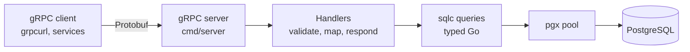

# Buddy.me Backend

The data foundation behind Buddy.me, written in Go: users, roadmaps and checkpoints, served over gRPC and backed by PostgreSQL.


## What is Buddy.me?

Buddy.me pairs two people around a shared goal. Instead of matching on likes and bios, it watches how people move through a structured journey, called a **roadmap**, and infers who would make a good walking partner. Each roadmap is a series of **checkpoints**, and each checkpoint is a chance to learn something about how you work.

This repository is the backend that stores all of that. It is also the groundwork for the [Rabbit-Hole Inference Algorithm (RHIA)](https://rayvah.cc/posts/rabbit-hole-interface-system), the part of Buddy.me that turns progress into matches. If you'd like the full story first, start with [what, why and how](https://rayvah.cc/posts/buddy-me-intro-what-why-how).

## Quick start

You'll need Go 1.23.4 or newer, PostgreSQL, `psql`, and the [golang-migrate](https://github.com/golang-migrate/migrate) and [grpcurl](https://github.com/fullstorydev/grpcurl) CLIs.

```bash
git clone https://github.com/30Piraten/buddy-backend.git
cd buddy-backend

# 1. Tell the app where Postgres lives (the Makefile reads .env too)
cat > .env <<'ENV'
POSTGRES_DSN=postgres://<user>:<password>@localhost:5432/buddy?sslmode=disable
POSTGRES_TEST_DSN=postgres://<user>:<password>@localhost:5432/buddy_test?sslmode=disable
ENV

# 2. Create the databases and apply the schema
createdb buddy && createdb buddy_test
make migrate-up
make migrate-test-up

# 3. Add sample data, then start the server on :9090
make db-seed
make run
```

In a second terminal, say hello:

```bash
make first-user
```

You should get a user back as JSON. `.env` is git-ignored, so your credentials stay local. Set `PORT` if you'd rather not use 9090.

## How it's built



Every module follows the same path: **proto, handler, sqlc, database**. A request comes in as a Protobuf message, the handler validates it and parses IDs, a generated query does the SQL, and the handler maps the row back to a Protobuf response. Handlers contain no SQL, and generated code contains no business rules, so once you've read one module you've read them all.

A few choices worth calling out:

- **Contract first.** The `.proto` files under `proto/<module>/v1` are the source of truth. `buf` lints them and generates the Go code, which is committed so a fresh clone builds right away.
- **Typed SQL, no ORM.** Queries live in plain `.sql` files and sqlc compiles them to Go. A broken query fails at generate time, not in production.
- **The database guards its own data.** Emails are unique, and checkpoint `type` and `status` are protected by `CHECK` constraints. The handlers translate between Protobuf enums and those database values.
- **Response envelopes.** Every RPC returns a wrapper message such as `GetUserResponse`, so fields can be added later without breaking clients.
- **Reflection is on.** `grpcurl` can discover services without the `.proto` files.
- **Sensible pooling.** The server uses a `pgx` pool capped at 10 connections.

## API reference

The server registers three services. Fully qualified method names look like `proto.users.v1.UserService/GetUser`.

| Module | Service | RPCs |
| --- | --- | --- |
| Users | `proto.users.v1.UserService` | `CreateUser`, `GetUser`, `ListUsers` |
| Roadmaps | `proto.roadmaps.v1.RoadmapService` | `CreateRoadmap`, `GetRoadmap`, `ListRoadmaps`, `UpdateRoadmap`, `DeleteRoadmap` |
| Checkpoints | `proto.checkpoints.v1.CheckpointService` | `CreateCheckpoint`, `GetCheckpoint`, `ListCheckpoints`, `UpdateCheckpoint`, `DeleteCheckpoint`, `ListUserCheckpoints` |

IDs are UUID strings, timestamps are `google.protobuf.Timestamp`, and `grpcurl` shows field names in camelCase (`createdAt`).

### Users

| Field | Type | Notes |
| --- | --- | --- |
| `id` | string (UUID) | Generated on create |
| `name` | string | Required |
| `email` | string | Required and unique |
| `created_at` | Timestamp | Set on create |

`CreateUser` takes `email` and `name`. It also accepts a `handle`, which is reserved for a future username and currently ignored. `ListUsers` accepts `page` and `page_size`, but returns everyone for now. `UpdateUser` and `DeleteUser` are planned for Phase 2, once account recovery and data retention are settled.

### Roadmaps

| Field | Type | Notes |
| --- | --- | --- |
| `id` | string (UUID) | Generated on create |
| `user_id` | string (UUID) | The owner. Required on create |
| `title` | string | Required |
| `description` | string | |
| `is_public` | bool | Defaults to false |
| `category` | string | |
| `tags` | repeated string | |
| `difficulty` | string | |
| `created_at` | Timestamp | |

`GetRoadmap` and `DeleteRoadmap` take `roadmap_id`. `ListRoadmaps` returns every roadmap, or one user's roadmaps when you pass `user_id`. `UpdateRoadmap` replaces all editable fields, so send the complete set.

### Checkpoints

| Field | Type | Notes |
| --- | --- | --- |
| `checkpoint_id` | string (UUID) | Generated on create |
| `roadmap_id` | string (UUID) | The roadmap this belongs to |
| `title` | string | Required |
| `description` | string | |
| `position` | int32 | Order within the roadmap |
| `type` | enum | `CHECKPOINT_TYPE_TYPE_LEARNING`, `_PRACTICE` or `_ASSESSMENT` |
| `status` | enum | `CHECKPOINT_STATUS_STATUS_PENDING`, `_IN_PROGRESS` or `_COMPLETED` |
| `estimated_time` | int32 | The seed data uses minutes |
| `reward_points` | int32 | |
| `created_at` | Timestamp | |

`ListCheckpoints` takes a `roadmap_id` and returns checkpoints ordered by `position`. `ListUserCheckpoints` takes a `user_id`, with optional `roadmap_id` and `status` filters, and is part of the upcoming progress model (see [Status](#status-and-known-issues)).

### Errors

Roadmap and checkpoint handlers answer with standard gRPC codes: `InvalidArgument` for malformed IDs or enums, `NotFound` when a roadmap or checkpoint doesn't exist, and `Internal` for most database failures. `CreateUser` returns `InvalidArgument` when `name` or `email` is missing.

### Try it with grpcurl

The server speaks plaintext locally, so every command uses `-plaintext`.

```bash
# What's on offer?
grpcurl -plaintext localhost:9090 list
grpcurl -plaintext localhost:9090 describe proto.roadmaps.v1.RoadmapService

# Create a user
grpcurl -plaintext -d '{"email":"alice@buddy.me","name":"Alice"}' \
  localhost:9090 proto.users.v1.UserService/CreateUser

# Create a roadmap for that user
grpcurl -plaintext -d '{
  "user_id": "<user-uuid>",
  "title": "Backend Bootcamp",
  "description": "Learn Go, PostgreSQL and APIs",
  "is_public": true
}' localhost:9090 proto.roadmaps.v1.RoadmapService/CreateRoadmap

# Add a checkpoint to it
grpcurl -plaintext -d '{
  "roadmap_id": "<roadmap-uuid>",
  "title": "Hello, Go",
  "description": "Write your first Go program",
  "position": 1,
  "type": "CHECKPOINT_TYPE_TYPE_LEARNING",
  "status": "CHECKPOINT_STATUS_STATUS_PENDING",
  "estimated_time": 25,
  "reward_points": 10
}' localhost:9090 proto.checkpoints.v1.CheckpointService/CreateCheckpoint
```

Prefer not to copy UUIDs around? The Makefile looks up real IDs for you:

```bash
make first-user          # also: first-roadmap, first-checkpoint
make fetch-all-users     # also: fetch-all-roadmaps, fetch-all-checkpoints
```

## Data model

Three migrations in `migrations/`, each with an `up` and a `down` file, create the tables.

| Table | Highlights |
| --- | --- |
| `users` | UUID primary key, `name` required, `email` required and unique |
| `roadmaps` | Owned by a `user_id`, with `is_public`, `category`, `tags` (text array) and `difficulty` |
| `checkpoints` | Belongs to a `roadmap_id`, ordered by `position`, with `CHECK`-constrained `type` and `status` |

Each module also keeps a `*_schema.sql` file under `internal/db/<module>/`. sqlc reads those to generate code, while golang-migrate applies the files in `migrations/` to real databases. Think of the migrations as the truth for your database and the schema files as the truth for the generated Go. When you change one, change the other and run `sqlc generate`.

Foreign keys between tables are not enforced yet. That arrives with the progress model.

## Testing

Tests run against a real PostgreSQL database, not mocks. Each test opens a `pgx` transaction and rolls it back at the end, so tests never leave anything behind and never trip over each other.

```bash
make migrate-test-up   # once, to prepare the test database
make test              # everything under ./tests/...
make test-users        # or test-roadmaps / test-checkpoints
```

There are nine tests, three per module (create, get, list), and the setup helpers use timeout contexts so a stuck connection fails fast. They currently exercise the generated query layer directly. Handler-level tests are the next addition.

To see how much code the tests touch, point coverage at the application packages, because the tests live in their own directory:

```bash
go test -coverpkg=./internal/...,./cmd/... -cover ./tests/...
```

## Working on the code

A typical change flows from the outside in:

1. **Contract:** edit `proto/<module>/v1/*.proto`, then run `buf lint && buf generate`.
2. **Schema:** add a migration with `migrate create -ext sql -dir migrations -seq <name>`, write both `up` and `down`, and update the matching `*_schema.sql`.
3. **Queries:** edit `internal/db/<module>/*_query.sql` and run `sqlc generate`.
4. **Handler:** validate input, call the generated method, map the result to Protobuf.
5. **Tests:** add one under `tests/<module>/` and run `make test`.

Generated code is committed, so include it in the same commit as the change that produced it. To reproduce the committed output exactly, use the tool versions recorded in the generated files:

```bash
go install github.com/sqlc-dev/sqlc/cmd/sqlc@v1.29.0
go install google.golang.org/protobuf/cmd/protoc-gen-go@v1.36.6
go install google.golang.org/grpc/cmd/protoc-gen-go-grpc@v1.5.1
go install github.com/bufbuild/buf/cmd/buf@latest
```

CI (`.github/workflows/backend.yaml`) runs three stages on every push that touches Go, proto or SQL files: lint (`sqlc generate`, `buf lint`, `buf generate`), build (`go build ./...`) and test (`go test ./...`).

## Project layout

```text
cmd/server/          Entry point: connects to Postgres, registers services and reflection
internal/handlers/   gRPC handlers: users/, roadmap/, checkpoints/
internal/db/         sqlc schema, queries and generated code, one folder per module
internal/logging/    zerolog console setup
internal/services/   Reserved for business logic (empty for now)
proto/               Protobuf contracts (v1)
gen/go/proto/        Generated Go code (committed)
migrations/          golang-migrate files, 000001 to 000003
seed/                Sample data for local development
tests/               users/, roadmap/, checkpoints/, plus shared helpers in common/
utils/               UUID parsing and enum mapping
docs/users/          A deep dive into the Users module
```

## Status and known issues

Phase 1, *Backend Foundations*, delivers the core data layer. Here is where things stand.

| Area | Status |
| --- | --- |
| Users: create, get, list | ✅ Working |
| Roadmaps: create, list all, update, delete | ✅ Working |
| Checkpoints: create, get, list by roadmap, update, delete | ✅ Working |
| Migrations, seed data, grpcurl smoke tests | ✅ Working |
| Per-user roadmap and checkpoint listing | 🚧 In progress |
| Progress model and events for RHIA | 🚧 Planned for Phase 2 |

Known issues, in rough priority order:

- **Per-user checkpoints.** `ListUserCheckpoints` needs a `user_checkpoints` table, and there's no migration for it yet, so the call returns an error until the progress model lands.
- **Roadmap details.** Roadmap responses don't yet include `category`, `tags` or `difficulty`, and `GetRoadmap` returns a reduced record. Listing roadmaps by `user_id` also needs a fix.
- **List filters.** `ListUsers` ignores pagination, and `ListRoadmaps` only honors `user_id`.
- **Security.** There is no authentication or TLS yet, so run the server locally or on a trusted network.
- **Seed data.** Seeded checkpoints aren't attached to the seeded roadmaps yet.
- **Test coverage.** Tests don't cover the handlers yet, and the CI test job doesn't provision PostgreSQL.

Coming in Phase 2: `UpdateUser` and `DeleteUser`, pagination, progress tracking and an events module for RHIA, foreign keys, and module docs for roadmaps and checkpoints.

## Learn more

- [Users module deep dive](docs/users/README.md)
- [Buddy.me: what, why and how](https://rayvah.cc/posts/buddy-me-intro-what-why-how)
- [Rabbit-Hole Inference Algorithm (RHIA)](https://rayvah.cc/posts/rabbit-hole-interface-system)

## License

MIT. See [LICENSE](LICENSE).