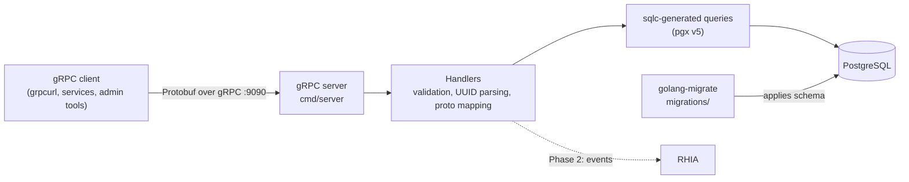

# Buddy.me Backend

The backend for Buddy.me: a Go gRPC service backed by PostgreSQL that serves as the system of record for users, roadmaps, and checkpoints.


[Learn more about Buddy.me](https://rayvah.cc/buddy)

## Contents

- [What Buddy.me is](#what-buddyme-is)
- [Architecture](#architecture)
- [Technology stack](#technology-stack)
- [Repository structure](#repository-structure)
- [API and service structure](#api-and-service-structure)
- [Getting started](#getting-started)
- [Development workflow](#development-workflow)
- [Testing](#testing)
- [Interacting with the API using grpcurl](#interacting-with-the-api-using-grpcurl)
- [Database and migrations](#database-and-migrations)
- [Project status](#project-status)
- [Further documentation](#further-documentation)
- [License](#license)

## What Buddy.me is

Buddy.me is a progress-driven personal growth platform. Instead of offering open-ended choices, it guides users through **roadmaps**: structured, system-authored curricula made up of ordered **checkpoints**. Users advance through a roadmap and can skip checkpoints, which behave like optional modules. The model is similar to language-learning apps: shared structure, individual progress.

This repository contains the backend. Phase 1, *Backend Foundations*, builds the core data layer that models:

- **Users**: individual accounts and identity.
- **Roadmaps**: system-authored curricula that users cannot edit.
- **Checkpoints**: ordered steps within a roadmap.

Phase 1 also lays the groundwork for **RHIA**, the downstream component that will consume progress events (for example, a completed checkpoint) and drive user-facing logic in Phase 2.

### Design principles

- **Simple and testable first.** Phase 1 favors records that work and are easy to verify. Refinements follow in later phases.
- **Contract first.** Protobuf definitions, versioned under `v1`, are the source of truth for every API.
- **Typed SQL over an ORM.** Queries are written in SQL and compiled to type-safe Go with sqlc.
- **Progress over preference.** Roadmaps and checkpoints are not user-editable, which keeps shared progress consistent.
- **Intent-first APIs.** Endpoints reflect product intent rather than exposing raw tables.

## Architecture



### Request lifecycle

1. A client calls an RPC on the gRPC server (default port `9090`).
2. The module's handler validates the request and parses identifiers into UUIDs.
3. The handler calls a sqlc-generated query method.
4. The query runs against PostgreSQL through pgx.
5. The handler maps the database model to a Protobuf message and returns it in a response envelope.

### Layering

Each module follows the same strict layering: **proto ↔ handler ↔ sqlc ↔ database**. Handlers contain no SQL, and generated query code contains no business logic. Every module (users, roadmaps, checkpoints) repeats this pattern, which keeps the codebase predictable as it grows.

## Technology stack

| Area | Technology | Notes |
| --- | --- | --- |
| Language | Go 1.23.4 | Module: `github.com/30Piraten/buddy-backend` |
| Transport | gRPC (`google.golang.org/grpc` v1.72.0) | Contract-based APIs |
| Contracts | Protocol Buffers (`google.golang.org/protobuf` v1.36.6) | Versioned under `proto/<module>/v1`; generated with `buf` |
| Database | PostgreSQL | System of record |
| Driver | `pgx` v5.7.4 | Used as sqlc's `sql_package` |
| Queries | sqlc | Typed Go bindings generated from SQL |
| Migrations | golang-migrate CLI | Plain SQL files in `migrations/` |
| Identifiers | `google/uuid` v1.6.0 | UUIDs for all primary keys |
| Logging | zerolog v1.34.0 | Structured logging |
| Configuration | `.env` + `godotenv` v1.5.1 | Loaded by the Makefile and the application |
| Testing | `testify` v1.9.0, `pgx` transactions | Table-driven tests with rollback isolation |
| Tooling | Make, grpcurl, psql, buf | Reproducible local workflow |
| CI | GitHub Actions | Workflow definitions in `.github/workflows` |

## Repository structure

```text
.
├── cmd/server/          # gRPC server entry point (main.go)
├── internal/
│   └── db/
│       ├── users/       # user_schema.sql, user_query.sql, user_generated/ (package usergen)
│       ├── roadmaps/    # roadmap_schema.sql, roadmap_query.sql, roadmap_generated/ (package roadmapgen)
│       └── checkpoints/ # checkpoint_schema.sql, checkpoint_query.sql, checkpoint_generated/ (package checkpointgen)
├── proto/               # Protobuf service contracts, one directory per module (v1)
├── gen/go/proto/        # Generated Go code for the contracts (output of buf)
├── migrations/          # SQL migrations applied with golang-migrate
├── seed/                # users.sql, roadmap.sql, checkpoints.sql
├── tests/               # users/, roadmap/, checkpoints/
├── utils/               # Shared utilities
├── docs/users/          # Users module deep dive
├── .github/workflows/   # CI definitions
├── buf.yaml             # buf module configuration
├── buf.gen.yaml         # Code generation plugins and output paths
├── sqlc.yaml            # sqlc configuration for all modules
├── Makefile             # Run, migrate, seed, test, and grpcurl targets
└── go.mod
```

Handlers and the database layer both live under `internal/`, so they are not importable from outside this module.

## API and service structure

The server exposes one gRPC service per module. All services use the `v1` API version and wrap results in `*Response` messages, which leaves room for error metadata and pagination without breaking clients.

| Module | Service | Package | RPCs |
| --- | --- | --- | --- |
| Users | `UserService` | `proto.users.v1` | `CreateUser`, `GetUser`, `ListUsers` |
| Roadmaps | `RoadmapService` | `proto.roadmaps.v1` | `CreateRoadmap`, `GetRoadmap`, `ListRoadmaps`, `DeleteRoadmap` |
| Checkpoints | `CheckpointService` | `proto.checkpoints.v1` | `CreateCheckpoint`, `GetCheckpoint`, `ListCheckpoints`, `DeleteCheckpoint` |
| Events | Not implemented | n/a | Placeholder schema for Phase 2 |

Fully qualified method names take the form `<package>.<Service>/<Method>`, for example `proto.users.v1.UserService/GetUser`.

### Conventions

- **Identifiers** are UUID strings.
- **Timestamps** use `google.protobuf.Timestamp`. grpcurl renders them in RFC 3339 format with camelCase field names (for example, `createdAt`).
- **Responses** are wrapped in a message envelope such as `GetUserResponse`.
- **Authoring rules.** Roadmaps and checkpoints are system-authored and have no update RPC. Users cannot modify or delete them.

### Users

The foundational identity layer and the root for roadmap assignment and checkpoint progress.

| RPC | Request fields | Behavior |
| --- | --- | --- |
| `CreateUser` | `email`, `name`, `handle` (reserved) | Validates input, generates the UUID and creation timestamp, and stores the user |
| `GetUser` | `id` | Returns the user, or an error if the ID is invalid or not found |
| `ListUsers` | `page`, `page_size` | Returns all users. Pagination fields are defined but not yet applied |

A user has an `id`, `name`, `email`, and `created_at`. `UpdateUser` and `DeleteUser` are deferred to Phase 2, pending decisions on account recovery, soft deletion, and GDPR-aligned data retention.

### Roadmaps

System-authored curriculum scaffolding that provides shared structure for progress.

| RPC | Request fields |
| --- | --- |
| `CreateRoadmap` | See `proto/roadmaps/v1` |
| `GetRoadmap` | `roadmap_id` |
| `ListRoadmaps` | See `proto/roadmaps/v1` |
| `DeleteRoadmap` | See `proto/roadmaps/v1` |

### Checkpoints

Ordered steps that belong to a roadmap. Users can skip checkpoints, but cannot modify or delete them.

| RPC | Request fields |
| --- | --- |
| `CreateCheckpoint` | See `proto/checkpoints/v1` |
| `GetCheckpoint` | `checkpoint_id` |
| `ListCheckpoints` | See `proto/checkpoints/v1` |
| `DeleteCheckpoint` | See `proto/checkpoints/v1` |

For complete message definitions, the `.proto` files under `proto/` are the source of truth.

## Getting started

### Prerequisites

| Tool | Purpose |
| --- | --- |
| Go 1.23.4 or later | Build and run the server |
| PostgreSQL | Primary datastore, plus a second database for tests |
| `psql` | Seeding and the Makefile's ID lookups |
| [golang-migrate](https://github.com/golang-migrate/migrate) CLI | Apply migrations |
| [grpcurl](https://github.com/fullstorydev/grpcurl) | Call the API from the command line |
| [buf](https://buf.build) and [sqlc](https://sqlc.dev) | Only needed to regenerate code |

Install the Go-based tools:

```bash
go install -tags 'postgres' github.com/golang-migrate/migrate/v4/cmd/migrate@latest
go install github.com/fullstorydev/grpcurl/cmd/grpcurl@latest
go install github.com/sqlc-dev/sqlc/cmd/sqlc@latest
go install github.com/bufbuild/buf/cmd/buf@latest
go install google.golang.org/protobuf/cmd/protoc-gen-go@latest
go install google.golang.org/grpc/cmd/protoc-gen-go-grpc@latest
```

### Setup

1. Clone the repository and download dependencies.

   ```bash
   git clone https://github.com/30Piraten/buddy-backend.git
   cd buddy-backend
   go mod download
   ```

2. Create a `.env` file in the repository root. The Makefile loads it automatically. Replace the placeholders with your own credentials, and never commit them.

   ```bash
   POSTGRES_DSN=postgres://<user>:<password>@localhost:5432/buddy?sslmode=disable
   POSTGRES_TEST_DSN=postgres://<user>:<password>@localhost:5432/buddy_test?sslmode=disable
   ```

3. Create the development and test databases. The names must match your DSNs.

   ```bash
   createdb buddy
   createdb buddy_test
   ```

4. Apply the migrations to both databases.

   ```bash
   make migrate-up
   make migrate-test-up
   ```

5. Seed the development database with sample users, roadmaps, and checkpoints.

   ```bash
   make db-seed
   ```

6. Start the server. It listens on port `9090`.

   ```bash
   make run
   ```

7. In a second terminal, confirm the service responds.

   ```bash
   make first-user
   ```

### Makefile targets

| Target | Description |
| --- | --- |
| `make run` | Start the gRPC server (`go run cmd/server/main.go`) |
| `make migrate-up` / `make migrate-down` | Apply or revert migrations on the development database |
| `make migrate-test-up` / `make migrate-test-down` | Apply or revert migrations on the test database |
| `make db-seed` | Load `seed/users.sql`, `seed/roadmap.sql`, and `seed/checkpoints.sql` |
| `make test` | Run all tests under `./tests/...` |
| `make test-users`, `make test-roadmaps`, `make test-checkpoints` | Run one module's tests |
| `make first-user`, `make first-roadmap`, `make first-checkpoint` | Fetch the first record of each type through gRPC |
| `make fetch-all-users`, `make fetch-all-roadmaps`, `make fetch-all-checkpoints` | Fetch every record of each type through gRPC |

Targets that touch the database fail fast with a clear message if `POSTGRES_DSN` or `POSTGRES_TEST_DSN` is not set.

## Development workflow

A typical change moves through the layers from the outside in:

1. **Define the contract.** Edit or add a `.proto` file under `proto/<module>/v1/`, then regenerate Go code:

   ```bash
   buf lint
   buf generate
   ```

   Generated files are written to `gen/go` with source-relative paths.

2. **Change the schema.** Add a migration under `migrations/` (see [Database and migrations](#database-and-migrations)) and update the module's `*_schema.sql` so sqlc sees the same schema.

3. **Write the queries.** Add or edit named queries in the module's `*_query.sql`, then regenerate:

   ```bash
   sqlc generate
   ```

4. **Implement the handler.** Validate input, convert identifiers, call the generated query method, and map the result to a Protobuf message.

5. **Test.** Add table-driven tests under `tests/<module>/` and run `make test`.

6. **Verify through the API.** Start the server with `make run` and exercise the new RPC with grpcurl.

### Adding a new module

1. Create `proto/<module>/v1/<module>.proto` and run `buf generate`.
2. Create `internal/db/<module>/` with a schema file and a query file.
3. Add a matching entry to `sqlc.yaml` and run `sqlc generate`.
4. Add a migration for the new tables.
5. Implement the handler and register the service in `cmd/server`.
6. Add tests under `tests/<module>/` and Makefile targets for them.

### Conventions

- Keep SQL in `.sql` files. Handlers call generated methods only.
- Use `uuid.Parse` to validate incoming identifiers and return an error for malformed values.
- Log with zerolog using structured fields.
- Keep API changes backward compatible within `v1`.

## Testing

Tests run against a real PostgreSQL database, not mocks, and are isolated by transactions.

| Practice | Benefit |
| --- | --- |
| `pgx.Tx` rollback | Each test runs in a transaction that is rolled back, so no state leaks between tests |
| Table-driven style | Reusable helpers, clean assertions, and explicit edge cases |
| Timeout contexts | Prevents hung tests and shortens feedback loops |
| Handler-level tests | No gRPC server boot, so tests execute quickly |
| `require.*` assertions | Fail-fast, readable output |
| grpcurl verification | Confirms the interface contract manually and in scripts |

### Run the tests

Apply migrations to the test database once, then run the suite:

```bash
make migrate-test-up
make test
```

Run a single module or a single test:

```bash
make test-users
go test -v ./tests/users/... -run TestCreateUser
```

### Example

```go
func TestCreateUser(t *testing.T) {
    pool := common.InitTestDB(t)
    db, tx := SetupTestDB(t, pool)
    defer tx.Rollback(context.TODO())

    handler := NewUserHandler(db)

    req := usergen.CreateUserParams{
        ID:        uuid.New(),
        Name:      "Test User",
        Email:     "unit@test.com",
        CreatedAt: time.Now(),
    }

    user, err := handler.db.CreateUser(context.Background(), req)
    require.NoError(t, err)
    require.Equal(t, req.Email, user.Email)
    require.NotZero(t, user.ID)
}
```

## Interacting with the API using grpcurl

Start the server with `make run`. The server listens on `localhost:9090` without TLS, so every command uses `-plaintext`.

### Discover services

The Makefile targets call grpcurl without `-proto` flags, which relies on server reflection. With reflection available, you can explore the API directly:

```bash
grpcurl -plaintext localhost:9090 list
grpcurl -plaintext localhost:9090 describe proto.users.v1.UserService
```

If reflection is unavailable, point grpcurl at the contract instead:

```bash
grpcurl -plaintext -import-path . -proto proto/users/v1/users.proto \
  localhost:9090 list
```

### Create and fetch a user

```bash
grpcurl -plaintext \
  -d '{"email":"alice@buddy.me","name":"Alice"}' \
  localhost:9090 proto.users.v1.UserService/CreateUser
```

```json
{
  "user": {
    "id": "c6f0efcd-7d10-49fd-abc2-0812dcf1c8aa",
    "name": "Alice",
    "email": "alice@buddy.me",
    "createdAt": "2025-05-14T12:34:56Z"
  }
}
```

```bash
grpcurl -plaintext \
  -d '{"id":"c6f0efcd-7d10-49fd-abc2-0812dcf1c8aa"}' \
  localhost:9090 proto.users.v1.UserService/GetUser
```

### List users

```bash
grpcurl -plaintext -d '{"page":1,"page_size":20}' \
  localhost:9090 proto.users.v1.UserService/ListUsers
```

All users are returned today, regardless of the pagination fields.

### Fetch a roadmap or checkpoint

```bash
grpcurl -plaintext \
  -d '{"roadmap_id":"<roadmap-uuid>"}' \
  localhost:9090 proto.roadmaps.v1.RoadmapService/GetRoadmap

grpcurl -plaintext \
  -d '{"checkpoint_id":"<checkpoint-uuid>"}' \
  localhost:9090 proto.checkpoints.v1.CheckpointService/GetCheckpoint
```

### Scripted smoke tests

The Makefile looks up real IDs with `psql` and calls the API for you, so you do not need to copy UUIDs by hand:

```bash
make first-user
make fetch-all-roadmaps
make fetch-all-checkpoints
```

The `fetch-all-*` targets skip any value that is not a valid 36-character UUID and print a warning. Run them before pushing proto or handler changes as a quick contract check.

## Database and migrations

### Schema sources

The schema is defined in two places that must stay in sync:

| Location | Used by | Purpose |
| --- | --- | --- |
| `migrations/` | golang-migrate | Applies schema changes to real databases |
| `internal/db/<module>/*_schema.sql` | sqlc | Lets sqlc type-check queries and generate Go code |

sqlc does not apply migrations. It reads the `*_schema.sql` files only to generate code, so update both whenever the schema changes.

### sqlc configuration

`sqlc.yaml` (version 2) defines one PostgreSQL target per module, each generating code with the `pgx/v5` package and JSON tags:

| Module | Generated package | Output directory |
| --- | --- | --- |
| Users | `usergen` | `internal/db/users/user_generated` |
| Roadmaps | `roadmapgen` | `internal/db/roadmaps/roadmap_generated` |
| Checkpoints | `checkpointgen` | `internal/db/checkpoints/checkpoint_generated` |

Type overrides map `uuid` to `github.com/google/uuid.UUID` and timestamp columns to `time.Time`. Run `sqlc generate` after any change to a schema or query file.

### Users table

```sql
CREATE TABLE users (
  id UUID PRIMARY KEY,
  name TEXT,
  email TEXT,
  created_at TIMESTAMP DEFAULT now()
);
```

| Column | Purpose |
| --- | --- |
| `id` | UUID generated at creation. Primary key |
| `name` | Display name, validated in the handler |
| `email` | Primary external identity link, required and validated |
| `created_at` | Server-generated timestamp for ordering and audit trails |

### Running migrations

```bash
make migrate-up         # apply all pending migrations (POSTGRES_DSN)
make migrate-down       # revert migrations (POSTGRES_DSN)
make migrate-test-up    # apply all pending migrations (POSTGRES_TEST_DSN)
make migrate-test-down  # revert migrations (POSTGRES_TEST_DSN)
```

These targets wrap `migrate -path migrations -database "$POSTGRES_DSN" up|down`. Treat `migrate-down` as destructive and avoid running it against any database that holds data you need.

### Creating a migration

Follow the numbering convention of the existing files in `migrations/`. With golang-migrate, a sequential pair of files is created like this:

```bash
migrate create -ext sql -dir migrations -seq <short_description>
```

Write both the `up` and `down` statements, apply them with `make migrate-up` and `make migrate-test-up`, then update the matching `*_schema.sql` and run `sqlc generate`.

### Seed data

`make db-seed` runs, in order, `seed/users.sql`, `seed/roadmap.sql`, and `seed/checkpoints.sql`. The order matters because checkpoints belong to roadmaps. Seed data is for development only.

## Project status

**Phase 1 (Backend Foundations) is complete.**

| Deliverable | Status |
| --- | --- |
| Users via gRPC (create, get, list) | Done |
| Roadmaps via gRPC (create, get, list, delete) | Done |
| Checkpoints via gRPC (create, get, list, delete) | Done |
| `pgx.Tx` test coverage | Done |
| grpcurl interface tests | Done |
| Logging and migrations | Done |
| Structured Makefile | Done |
| Phase 1 documentation | Done |

### Planned for Phase 2

- `UpdateUser` and `DeleteUser`, including account recovery, soft deletion, and data retention policy.
- An events module that records activity such as completed checkpoints, consumed by RHIA.
- Pagination for list endpoints.
- Module documentation for roadmaps and checkpoints, an entity-relationship diagram, and flow diagrams.

### Scope and limitations

- The server listens without TLS, and no authentication or authorization layer is documented. Run it locally or inside a trusted network boundary.
- "Admin-only" behavior for roadmaps and checkpoints is a design requirement. Access control is not yet part of the documented scope.

## Further documentation

- [Users module deep dive](docs/users/README.md): schema, protobuf API, sqlc mapping, handler logic, tests, and request flow.

## License

This project is licensed under the MIT License. See [LICENSE](LICENSE) for details.
