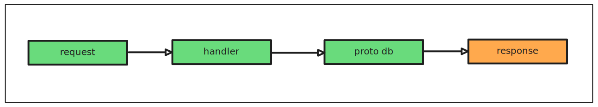

# 📂 Phase 1: Backend Foundations — Users Module

## Overview

The **Users module** is the foundational (click-tree) identity layer in `buddy.me`. It models individual user accounts and provides essential CRUD (Create, Read, List) functionality via gRPC.

### What it defines

* It defines the base system-of-record for all user data.
* It is the first touchpoint in user-related logic (e.g., roadmap assignment, checkpoint progress).
* Update and Delete operations are intentionally deferred to Phase 2 to allow time for deeper UX and system-level decisions like account recovery, soft-deletion, and GDPR-aligned data retention.

This document breaks down schema design, protobuf APIs, SQLC mapping, gRPC handler logic, and tests.


---

## 1. 📐 Schema Definition (`user_schema.sql`)

The `users` table is lean and intentionally minimal. It captures only what is required to establish identity, uniquely identify users, and support deterministic ordering and retrieval.

```sql
CREATE TABLE users (
  id UUID PRIMARY KEY,
  name TEXT,
  email TEXT,
  created_at TIMESTAMP DEFAULT now()
);
```

### Field Notes

| Column       | Purpose                                                       |
| ------------ | ------------------------------------------------------------- |
| `id`         | UUIDv4 generated at creation. Primary key.                    |
| `name`       | Full display name. Optional for now; validated in handler.    |
| `email`      | Unique identifier. Required and validated.                    |
| `created_at` | Server-generated timestamp. Used for ordering + audit trails. |

> Email will serve as the primary external identity link for most user flows (e.g., login, invite, social graph bootstrap).

---

## 2. 🧬 Protobuf API (`users.proto`)

The API definition lives under `proto/users/v1/users.proto` and drives the gRPC contract between frontend, internal services, and admin tools.

```proto
message User {
  string id = 1;
  string name = 2;
  string email = 3;
  google.protobuf.Timestamp created_at = 4;
}
```

### Service Definition

```proto
service UserService {
  rpc CreateUser(CreateUserRequest) returns (CreateUserResponse);
  rpc GetUser(GetUserRequest) returns (GetUserResponse);
  rpc ListUsers(ListUserRequest) returns (ListUsersResponse);
}
```

All responses are wrapped using structured message envelopes (`*Response`) for versioning flexibility and compatibility with future expansion (e.g., error codes, metadata, pagination).

> ❌ `UpdateUser` and `DeleteUser` are not yet implemented. These will be handled in Phase 2 when account lifecycle policies are defined.

### Request/Response Messages

```proto
message CreateUserRequest {
  string email = 1;
  string handle = 2; // reserved for future display handle / unique username
  string name = 3;
}

message CreateUserResponse {
  User user = 1;
}

message GetUserRequest {
  string id = 1;
}

message GetUserResponse {
  User user = 1;
}

message ListUserRequest {
  int32 page = 1;
  int32 page_size = 2;
}

message ListUsersResponse {
  repeated User users = 1;
}
```

---

## 3. 📥 SQLC Queries (`user_query.sql`)

SQLC maps raw SQL into strongly typed Go methods, using a PostgreSQL engine and emitting Go code that wraps each query.

```sql
-- name: CreateUser :one
INSERT INTO users (id, name, email, created_at)
VALUES ($1, $2, $3, $4)
RETURNING *;

-- name: GetUser :one
SELECT * FROM users WHERE id = $1;

-- name: ListUsers :many
SELECT * FROM users;
```

### SQLC Config Snippet (YAML)

```yaml
sql:
  - engine: "postgresql"
    schema: "internal/db/users/user_schema.sql"
    queries: "internal/db/users/user_query.sql"
    gen:
      go:
        out: "internal/db/users/user_generated"
        package: "usergen"
        sql_package: "pgx/v5"
        emit_json_tags: true
        overrides:
          - db_type: "uuid"
            go_type: "github.com/google/uuid.UUID"
          - db_type: "timestamp"
            go_type: "time.Time"
```

> SQLC emits fast, safe, typed wrappers that reduce boilerplate and enforce query correctness at compile time.

### Example Output (Generated Method)

```go
func (q *Queries) CreateUser(ctx context.Context, arg CreateUserParams) (User, error)
```

---

## 4. 🧠 gRPC Handler Logic (`handler.go`)

The `UserHandler` wraps the SQLC queries and converts the underlying database logic into gRPC-compatible responses.

### `CreateUser`

```go
func (h *UserHandler) CreateUser(ctx context.Context, req *usersv1.CreateUserRequest) (*usersv1.CreateUserResponse, error)
```

* Validates input fields (email, name).
* Generates UUID and `created_at` timestamp.
* Delegates to SQLC-generated `CreateUser`.
* Returns a fully wrapped `User` proto.

### `GetUser`

```go
func (h *UserHandler) GetUser(ctx context.Context, req *usersv1.GetUserRequest) (*usersv1.GetUserResponse, error)
```

* Parses `req.Id` into a UUID.
* Queries database using SQLC.
* Returns the user object if found.

```go
func (h *UserHandler) GetUser(ctx context.Context, req *usersv1.GetUserRequest) (*usersv1.GetUserResponse, error) {
  uid, err := uuid.Parse(req.Id)
  if err != nil {
    log.Error().Err(err).Msg("Invalid UUID")
    return nil, err
  }

  user, err := h.db.GetUser(ctx, uid)
  if err != nil {
    log.Error().Err(err).Msg("User not found")
    return nil, err
  }

  return &usersv1.GetUserResponse{
    User: convertToProto(user),
  }, nil
}
```

### `ListUsers`

```go
func (h *UserHandler) ListUsers(ctx context.Context, req *usersv1.ListUserRequest) (*usersv1.ListUsersResponse, error)
```

* Ignores pagination for now (returns all users).
* Uses `convertToProto` to convert DB models to Protobuf messages.

### Utility Function

```go
func convertToProto(u usergen.User) *usersv1.User
```

---

## 5. 🧪 Unit Tests

Unit tests cover handler logic, isolated from network/gRPC. They use transactional rollback with `pgx.Tx` to ensure test repeatability and DB cleanliness.

```go
func TestCreateUser(t *testing.T) {
  pool := common.InitTestDB(t)
  db, tx := SetupTestDB(t, pool)
  defer tx.Rollback(context.TODO())

  handler := NewUserHandler(db)

  req := usergen.CreateUserParams{
    ID:        uuid.New(),
    Name:      "Test User",
    Email:     "unit@test.com",
    CreatedAt: time.Now(),
  }

  user, err := handler.db.CreateUser(context.Background(), req)
  require.NoError(t, err)
  require.Equal(t, req.Email, user.Email)
  require.NotZero(t, user.ID)
}
```

| Practice            | Benefit                      |
| ------------------- | ---------------------------- |
| ✅ `pgx.Tx` rollback | Isolated DB state per test   |
| ✅ No gRPC boot      | Fast execution               |
| ✅ `require.*`       | Clear, fail-fast test output |

---

## 6. 🧪 gRPC CLI (grpcurl)

Example usage of CLI testing via `grpcurl`:

```bash
make run # runs gRPC server on port 9090

grpcurl -plaintext -d '{"email":"alice@buddy.me", "name":"Alice"}' localhost:9090 proto.users.v1.UserService/CreateUser
```

```json
{
  "user": {
    "id": "c6f0efcd-7d10-49fd-abc2-0812dcf1c8aa",
    "name": "Alice",
    "email": "alice@buddy.me",
    "createdAt": "2025-05-14T12:34:56Z"
  }
}
```

> Handy for manual smoke tests during backend development or before pushing new proto changes.

---

## 7. 🔄 Flow Diagram

Here’s the lifecycle of a typical user request in the system:



---

## Final Notes

* The Users module is stable, test-covered, and forms the root for user-centric modules like Roadmaps, Checkpoints, Progress, and Sessions.
* All logic follows strict layering: proto ↔ handler ↔ SQLC ↔ DB.
* Deferred operations (Update, Delete) will revisit the schema, handler logic, and lifecycle policies holistically in Phase 2.
